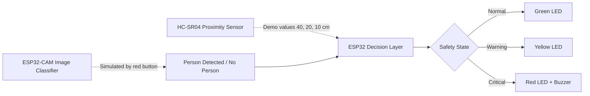

# System Architecture

```mermaid
flowchart LR
    A[ESP32-CAM Image Classifier] -. Simulated by red button .-> B[Person Detected / No Person]
    C[HC-SR04 Proximity Sensor] -. Demo values 40, 20, 10 cm .-> D[ESP32 Decision Layer]
    B --> D
    D --> E{Safety State}
    E -->|Normal| F[Green LED]
    E -->|Warning| G[Yellow LED]
    E -->|Critical| H[Red LED + Buzzer]
```

## Simulation Mapping

- Red pushbutton: simulated camera prediction.
- ESP32: local decision layer.
- LEDs and buzzer: safety actions.
